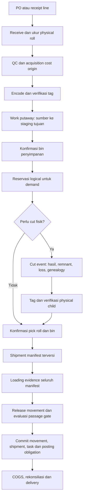

# RFID dan WMS: pembanding enterprise dan blueprint proyek

Review 29 September 2026, baseline KNHOST `d1fd56e4f0fbd1af1a46bc0b9932dc8545d78467`.

## Penilaian kelayakan

KNHOST memiliki cakupan fitur yang cukup luas untuk dikembangkan menjadi WMS khusus tekstil: physical roll, owner, lot, unit/measurement, GRN, inspeksi, struktur gudang, putaway, transfer, picking, shipment, RFID, count dan integrasi Finance. Namun pada snapshot ini saya **belum merekomendasikan RFID sebagai kontrol pelepasan barang otomatis atau saldo Finance sebagai angka final tanpa rekonsiliasi**. Alasannya adalah cacat identitas, concurrency, otorisasi movement dan posting yang telah ditunjukkan, bukan sekadar belum mempunyai fitur optimisasi enterprise.

Fitur yang sudah ada tidak perlu dibuang. Prioritasnya memperbaiki kontrak antarfitur, kemudian menguji satu flow utuh dengan perangkat nyata. Menambah wave, dashboard atau antena tidak menyelesaikan roll pick yang berbeda dari roll dispatch.

## Kebutuhan proyek yang menjadi dasar

Konteks chat “RFID untuk WMS Enterprise” dan “Recall RFID gate discussion” digunakan kembali: roll tekstil dapat dipotong sebagian, satu tag untuk satu roll fisik, sisa meter berasal dari WMS/pengukuran, bangunan gudang dibedakan menurut jenis kain, gate IN/OUT pada D/H, handheld untuk bin, dan alarm untuk roll/tujuan salah. Rancangan tunnel sekitar 2,5 m, ACP 3 mm, enam antena per lane serta Chainway UR300 adalah konteks rancangan dari pembahasan tersebut, bukan instalasi yang telah diuji dalam audit ini.

Terdapat dua lapisan pembanding. **WMS enterprise** dibandingkan pada keputusan kerja, lokasi, inventory control dan exception. **Sistem RFID enterprise** dibandingkan pada identity binding, observation, filtering, passage, replay dan integrasi keputusan bisnis. Istilah RF pada dokumentasi SAP/Oracle sering berarti terminal mobile radio-frequency; itu bukan bukti bahwa transaksi tersebut memakai portal UHF RFID otomatis.

## Pembanding yang dapat dipertanggungjawabkan

| Pembanding primer | Kapabilitas yang didokumentasikan | Implikasi spesifik bagi KNHOST |
|---|---|---|
| [Microsoft — work templates/location directives](https://learn.microsoft.com/en-us/dynamics365/supply-chain/warehousing/control-warehouse-location-directives) | Work template menentukan rangkaian kerja; location directive menentukan lokasi pick/put sesuai jenis transaksi | PA/putaway perlu work line dan konfirmasi lokasi yang mengikat roll; aturan kategori gudang saja belum setara directed work |
| [Microsoft — batch/serial/license plate/location confirmation](https://learn.microsoft.com/en-us/dynamics365/supply-chain/warehousing/batch-and-license-plate-confirmation) | Konfirmasi identitas/lokasi dapat dikonfigurasi; ada pengecualian bergantung jenis kerja dan cara mulai scan | Backend KNHOST harus memeriksa kecocokan dengan task, tanpa mengasumsikan semua vendor mewajibkan scan setiap unit pada semua langkah |
| [Microsoft — replenishment](https://learn.microsoft.com/en-us/dynamics365/supply-chain/warehousing/replenishment) | Mendukung pengisian ulang berbasis template dan kebutuhan | Replenishment merupakan kapabilitas lanjutan bila ada reserve/pick face; bukan prasyarat membenarkan ledger dasar |
| [Microsoft — wave processing](https://learn.microsoft.com/en-us/dynamics365/supply-chain/warehousing/wave-processing) | Wave mengelompokkan proses alokasi, replenishment dan pembuatan picking work melalui template | Batch task biasa tidak otomatis sama dengan wave planning; bangun setelah manifest dan stock claims benar |
| [Oracle 26c — Split IBLPN](https://docs.oracle.com/en/cloud/saas/warehouse-management/26c/owmol/split-iblpn.html) | Split menyebut source LPN, destination LPN dan move qty. Ada pengaturan/panduan untuk menghindari kehilangan konteks PO/IB pada split sebelum putaway | KNHOST memerlukan cut confirmation dan acquisition provenance; rekomendasi urutan Oracle ini spesifik produknya, bukan hukum bahwa tekstil harus selalu dipotong setelah putaway |
| [Oracle 26c — detail cycle-count approval](https://docs.oracle.com/en/cloud/saas/warehouse-management/26c/owmol/approve-or-reject-cycle-count-adjustment-records-at-the-detail-level.html) | Approval/rejection detail dan recount dengan aturan kelompok/SKU dan kondisi tertentu | Count discrepancy harus menjadi work yang dapat diperiksa dan ditindaklanjuti; found/expected bukan otomatis izin adjust |
| [Oracle 26a — cycle-count inventory updates](https://docs.oracle.com/en/cloud/saas/warehouse-management/26a/owmol/reinitiate-in-progress-deferred-cycle-counts.html) | Menguraikan mode penyesuaian serta kontrol count yang masih berjalan/pending | Kebijakan concurrency/cutoff harus eksplisit; KNHOST tidak boleh approve adjustment parsial tanpa status yang sesuai |
| [SAP EWM — Putaway Using Radio Frequency](https://help.sap.com/docs/SAP_S4HANA_ON-PREMISE/9832125c23154a179bfa1784cdc9577a/7e54c3a031fc484ca12b6e6f1860703b.html) | Putaway HU melalui perangkat RF dan penanganan exception | Konfirmasi perjalanan, tiba, dan bin harus terpisah; exception memerlukan workflow resolusi, bukan hanya ubah journey |
| [Zebra ATR7000 — spesifikasi RTLS](https://www.zebra.com/ap/en/products/spec-sheets/rfid/rfid-readers/atr700.html) | Locationing, transition/direction dan software analytics untuk meneruskan lokasi ke sistem bisnis | Arah/lokasi merupakan hasil pengolahan observasi, bukan sifat otomatis string EPC. Kapabilitas ATR7000 tidak boleh diasumsikan ada pada UR300 |
| [GS1 EPCIS 2.0.1](https://ref.gs1.org/standards/epcis/2.0.1/) | Model visibility event memisahkan event time, read point, business context dan koreksi event | Berguna sebagai acuan kontrak evidence/traceability. Tidak wajib mengimplementasikan seluruh EPCIS untuk pilot internal |

Tabel ini membandingkan kapabilitas terpilih, bukan skor keseluruhan vendor, harga lisensi, atau hasil benchmark langsung. Keunggulan UI vendor tidak dinilai karena tidak ada usability test side-by-side. Angka akurasi perangkat dalam brosur juga tidak dijadikan jaminan untuk tunnel proyek ini.

## Matriks kebutuhan dan celah: RFID

Status “belum terbukti” berarti tidak terlihat cukup kuat pada jalur kode/kontrak yang ditelaah atau memerlukan artefak eksternal. Itu tidak sama dengan bukti bahwa tidak ada implementasi di luar repo. Wajib = diperlukan bagi proses yang Anda minta; lanjutan = bergantung volume/risiko. Rujukan RF/WM/FN/GN/AX mengarah ke dokumen 08 dan 09.

| Kemampuan | Kondisi KNHOST | Gap operasional | Prioritas / bukti penerimaan |
|---|---|---|---|
| EPC canonical end-to-end | Encode, ZPL dan lookup ada, format berbeda | Tag milik sendiri menjadi unknown | Wajib; RF-01: raw reader dikenali setelah encode |
| Binding tag↔roll | Active tag/retire tersedia | Reprint/replacement perlu version dan jejak fisik | Wajib; satu active binding per physical object dan EPC |
| Physical cut identity | Child helper ada | Child dapat lahir sebelum cut atau saat dispatch | Wajib; WM-02/AX-01: child diukur/tag sebelum release |
| Multi-generation genealogy | parent/root ada | Direct parent bisa salah | Wajib; AX-07: tiga generasi benar dan konservatif |
| Print queue | Job ZPL dan ACK ada | Tidak ada lease/attempt ownership memadai | Wajib; RF-15: dua printer tidak mengambil job sama tanpa recovery |
| Encode/print verification | Expected/missing/extra ada | Queued dianggap printed; retry issues buntu | Wajib; RF-14: queued≠encoded≠verified |
| Print-job isolation | Scope diperiksa saat create | Parent owner pertama membocorkan child | Wajib; AX-06: A-only tak melihat B |
| Device lifecycle | Online/offline/heartbeat/key ada | Disable bercampur dengan health | Wajib; RF-12/13: revoke tak pulih karena heartbeat |
| Device commissioning | Warehouse/direction ada | Lane/antenna profile/version belum terbukti | Wajib untuk gate; simpan profil dan hasil uji lapangan |
| Observation ingestion | EPC batch/log ada | Canonicalization, batch truncation dan raw metadata contract | Wajib; setiap input diterima/ditolak eksplisit |
| Cross-batch dedup/replay | Dedup satu batch | Tidak ada event identity tahan restart | Wajib; RF-16: resend menghasilkan satu effect |
| Passage/direction | Device direction dan read decision | Belum cukup membedakan lintasan/trolley/putar balik | Wajib gate; trial salah lane, reverse, stop, overlap |
| Active movement authorization | Status + PA branch | Dokumen batal/tujuan salah dapat green | Wajib; RF-02/03, AX-08: fail closed secara bisnis |
| Full-manifest loading | Check per SO bertag | Subset clean; shipment berubah sesudah check | Wajib bagi lane mandatory; RF-04–06/AX-01 |
| Evidence provenance | Scan/manual/simulasi terhubung | Simulasi dapat menjadi bukti operasional | Wajib; RF-07: simulation tidak dapat release produksi |
| Kiosk dan alarm | Fullscreen/read warna/siren | Stale green dan bukan ringkasan passage | Wajib; UX-01: stale tampil jelas, mixed result tidak green |
| Incident lifecycle | Read red → incident tersedia | Dedup, assignee dan resolusi fisik perlu kontrak | Wajib; acknowledgement tidak mengotorisasi movement |
| Last-seen locating | Lokasi reader dan roll tersedia | Last seen dapat disalahartikan current bin | Wajib label usia/batas bukti; RTLS presisi lanjutan |
| Presence count | Expected/missing/extra tersedia | Scope/cakupan/status/meter belum setara opname | Wajib; RF-08–10/17: kehadiran dan panjang dipisah |
| Offline edge recovery | Artefak adapter tidak ditemukan | Journal lokal, ordering, replay dan revocation belum diuji | Wajib sebelum operasi offline; RF-16 |

## Matriks kebutuhan dan celah: WMS

| Proses | Yang sudah terlihat | Gap terhadap proses enterprise/proyek | Keputusan |
|---|---|---|---|
| Warehouse/site/owner | Master warehouse, profile, scope | Pagar owner tidak seragam per roll | Wajib AX-04; shared site bukan shared ownership |
| Zone/rack/level/bin | Struktur dan putaway manual | Warehouse/bin dapat tidak konsisten setelah transfer | Wajib AX-05; validate structural membership |
| GRN/penerimaan | OCR, foto, count, reconciliation, variance, packing checklist | Bukti dokumen perlu terikat receipt line/actual roll; runtime supplier belum diuji | Pertahankan; integration test mixed receipt/duplicate/reversal |
| Inbound scan/UOM | Supplier scan, unreadable-label, catch-weight, trail | Normalisasi berbeda pada initial/legacy entry | Wajib FN-03/GN-13; conversion policy tunggal |
| QC/grade/hold | Inspection, grade, hold/release | PA/gate tidak konsisten dengan hold | Wajib AX-08; QC disposition orthogonal |
| Directed putaway | Kandidat gudang berdasar category/grade + set bin | Belum setara rules untuk work, capacity, compatibility dan confirmed bin | Minimal scan bin wajib; optimisasi bin bertahap |
| PA antarbangunan | Dokumen, dispatch, arrival, exception | ATP transit/roll claim/empty-arrival bermasalah | Wajib WM-03–05/09 |
| Transfer intra | Reservation dan roll transfer | Explicit ID scope; origin/bin receipt | Wajib AX-04/05 |
| Intercompany | Permintaan dan transaksi antarbadan usaha | Conversion race dan source identity | Wajib GN-08; ownership berubah melalui proses sah |
| Allocation/reservation | Policy/lot/location/earmark terlihat | Logical allocation bercampur physical split; concurrency | Wajib WM-01/02; physical existence invariant |
| Picking | Task, scan log, picked progress | Scan tidak memeriksa object/bin; dispatch reselect | Wajib WM-06/AX-01 |
| Packing/loading | Scan/task/loading SO | Manifest per shipment/version belum otoritatif | Wajib RF-05/06; freeze contents sebelum bukti |
| Partial shipment | Surat jalan dan task progress ada | Stale progress dan failure window | Wajib AX-02/03 |
| Return/R&D/production | Jalur issue/return/WO tersedia | Mutasi alternatif dapat merusak qty/identity/cost | Wajib GN-04–07; gunakan command core yang sama |
| Opname/adjustment | Count dan approval ada | Bin baseline, partial adjustment, variance GL | Wajib WM-07/08/FN-14 |
| Availability/ATP | Roll-derived balance | Snapshot cap, stale projection, transit still available | Wajib WM-04/GN-12/13 |
| Cost traceability | Unit cost, landed cost, GL integration | Perolehan hilang, propagation ganda, COGS mismatch | Wajib FN-01/03/11, AX-05 |
| Exception/recovery | Incident dan saga tooling | Unlock bukan reversal/recovery; orphan tanpa lock | Wajib GN-11/AX-02 |
| Wave/cluster picking | Task/fulfillment tersedia | Engine wave terarah setara pembanding belum terbukti | Lanjutan bila volume/tenaga memerlukan; jangan diklaim tidak ada hanya karena nama file |
| Replenishment/slotting | Struktur dan stok tersedia | Policy reserve→pick face/capacity work belum terbukti | Lanjutan; ukur kebutuhan sebelum membangun |
| Dock/yard/labor automation | Shipment/logistics ada | Appointment, yard orchestration, labor engineering belum dinilai setara | Di luar minimum gate-roll; backlog bila bisnis membutuhkan |

## Desain status yang mencegah konflik lintas modul

Jangan menambah semua konsep ke satu status roll. Gunakan dimensi independen dengan command yang memeriksa kombinasi sah:

| Dimensi | Contoh nilai | Command yang berwenang |
|---|---|---|
| Physical identity | existing / transformed / consumed | Receive, confirmed cut, consume |
| Tag | unassigned / encode_pending / verified / retired / replacement_pending | Encode/verify/replace tag |
| QC disposition | pending / released / hold / rejected | QC decision berotorisasi |
| Position | receiving / bin / staging / transit / customer | Confirmed movement |
| Commitment | free / reserved / picked / shipment-bound | Allocation dan warehouse execution |
| Work | open / claimed / in_progress / exception / completed | Work engine dengan version/fencing |
| Financial | unvalued / valued / posting_pending / posted / correction_pending | Costing dan posting service |

Contoh: tag verified + QC hold + position bin + free **tidak** berarti boleh shipment. Reprint hanya mengganti state tag; tidak boleh mengubah position atau commitment. Pindah ke ruang QC boleh menjadi movement type terpisah meski QC hold, sehingga aturan tidak terlalu membatasi operasi sah.

## Alur rujukan: satu roll dan satu shipment

Ini desain usulan, bukan representasi bahwa semua langkah tersebut sudah diterapkan KNHOST. Urutan receipt/cost final dapat asynchronous; acquisition identity dan kewajiban financial posting tetap harus persisten sejak awal. Gate tidak otomatis menjadi titik pengakuan revenue tanpa policy perpindahan kendali/terms bisnis.

## Kontrak edge–backend untuk gate D/H

**Konfigurasi:** gunakan lane IDs eksplisit D-IN, D-OUT, H-IN, H-OUT, warehouse/site mapping, daftar reader/antenna yang termasuk lane, configuration_version, enabled/revoked, heartbeat, dan operator mode. Direction dari konfigurasi hanya menyatakan tujuan lane; bukti bahwa trolley benar bergerak searah harus berasal dari desain fisik/sensor/algoritme yang telah diuji.

**Observation envelope usulan:** event_id unik stabil, reader_id, reader_boot_id, sequence, capture_time, received_time, antenna_id, canonical_epc, read_count, RSSI/phase bila tersedia, trigger state, lane/config version. Nilai yang tidak tersedia tidak boleh dibuat-buat. Timestamp clock-skew harus dapat didiagnosis. API mengakui accepted/duplicate/rejected satu per satu atau dengan ringkasan lengkap; jangan diam-diam memotong batch 500 lalu melaporkan sukses umum.

**Passage envelope usulan:** passage_id, open/close time, lane, inferred direction, confidence/status uncertain, accepted EPC set, excluded candidate reads beserta reason, sensor evidence refs, manifest_id/version dan decision_version. Edge boleh menyimpan raw samples dengan retention terpisah; backend operasional menyimpan ringkasan dan bukti yang cukup untuk replay/audit.

**Decision:** periksa device enabled dan config → passage cukup bukti → seluruh EPC dikenal/aktif → owner/source/movement membership → QC/operational block → manifest/current version → tujuan/time window → hasil. Gunakan green hanya jika semua prasyarat lengkap. Unknown atau uncertain jangan diterjemahkan menjadi clear. Kuning dapat berarti menunggu scan/recount/manual review; merah berarti pelanggaran teridentifikasi. Definisi warna harus konsisten dengan lampu fisik dan kiosk.

**Posting:** pilih satu command authority. Edge read boleh memicu usulan arrival/dispatch yang idempotent, tetapi tidak boleh ada dua writer independen (gate dan tombol UI) yang masing-masing mengurangi stok. operation_id dan current roll version mengikat keduanya. Movement decision dan committed movement disimpan terpisah agar green tidak disalahartikan posting selesai.

**Offline:** journal lokal menyimpan event belum ACK, retry dengan event_id sama, sequence/gap monitoring dan batas umur manifest cache. Untuk lane wajib authorization online, koneksi putus berarti tahan/review manual; jangan default green. Bila bisnis memilih offline release, policy harus membatasi manifest yang telah ditandatangani/disetujui, expiry dan revocation lag, lalu mencatat override. Ini pilihan kebijakan untuk disahkan, bukan fitur yang diasumsikan sudah ada.

**Security:** mTLS atau device credentials terkelola sesuai kemampuan perangkat/adapter, secret tidak masuk list UI/log, rotate/revoke, scope endpoint menurut device kind, dan anti-replay. EPC adalah identifier, bukan password atau bukti keaslian barang. Pencegahan tag cloning memerlukan threat model dan kapabilitas tag/reader tambahan; tidak otomatis diperoleh dengan unique EPC di database.

## Tunnel dan antena: apa yang harus dibuktikan di lokasi

Panjang tunnel dan jumlah antena tidak cukup untuk menyatakan read coverage atau pemisahan lane. ACP, rak/objek sekitar, orientasi label, tumpukan roll, trolley, kecepatan dan multipath perlu dicoba dengan konfigurasi reader yang sebenarnya. Spesifikasi RTLS Zebra merupakan pembanding konsep, bukan alasan mengganti UR300 tanpa kebutuhan yang dibuktikan.

| Uji lapangan | Yang diperiksa | Kondisi gagal yang wajib terlihat |
|---|---|---|
| Roll tunggal, tiap orientasi tag | Recall item benar per passage | Missing tidak boleh menghasilkan green |
| Trolley maksimum operasional | Seluruh expected terbaca dalam waktu lewat | Partial read menjadi incomplete/review |
| Tag diam dekat mulut/di rak | False inclusion | Tag tetangga tidak menambah isi manifest |
| Dua lane aktif bersamaan | Cross-lane attribution | EPC tidak diberi dua movement |
| Mundur/putar balik/berhenti | Direction dan passage reopen | OUT palsu tidak commit shipment |
| Dua trolley berdekatan | Passage separation | Manifest A/B tidak tercampur |
| Barcode fallback dan rusak tag | Controlled override/replacement | Scan manual tidak menyamar hardware |
| Putus jaringan/restart adapter | Durable replay dan sequence | Tidak hilang event atau double movement |
| Power loss saat print/encode | State uncertain/read-after-write | Tidak mengklaim label pasti tercetak |
| Wrong building/cancelled manifest/QC hold | Business decision | Selalu hold/red sesuai reason |

Ukur recall per physical item, false inclusion per passage, false-clear (green ketika seharusnya block), duplicate effects, decision latency p50/p95, serta waktu resolusi exception. Jangan memakai total raw read sebagai akurasi. Ambang read-rate/latency harus ditetapkan dari kecepatan trolley dan toleransi bisnis, lalu dilaporkan dengan ukuran sampel. Sebagai contoh statistik, nol false-clear pada 1.000 skenario independen bukan bukti risiko nol; batas atas kasar 95% masih sekitar 3/1.000. Uji operasional yang berkorelasi memerlukan interpretasi lebih hati-hati.

Frekuensi/power legal Indonesia dan dukungan regional SKU reader/tag belum disertifikasi pada review ini. Diskusi lama mengenai EU 865–868 tidak boleh otomatis menjadi konfigurasi produksi; commissioning harus memakai perangkat dan izin regional yang sah.

## UI/UX: penilaian berbasis kode dan rancangan perbaikan

Audit ini membaca komponen dan interaksi/API, bukan observasi pengguna di gudang. Karena itu saya tidak mengklaim ukuran tap target, kontras nyata, latensi atau alur focus sudah diukur. Masalah status/bukti di bawah didukung kode; rancangan usability perlu uji handheld dan kiosk sesungguhnya.

| Layar/persona | Masalah atau kebutuhan | Perubahan yang dapat diuji |
|---|---|---|
| Receiving operator — GRN/inbound scan | Informasi OCR, qty, unit, discrepancy dan fisik tersebar di panel | Satu work step menunjukkan PO line, product/lot, jumlah roll dan actual meter; OCR ditandai usulan; confirm sekali menghasilkan receipt operation_id |
| Label operator — print/verify | Queued disebut printed, retry issues tidak jelas, simulasi mencampur bukti | Step queued → printer claimed → encode uncertain/success → physical verify; daftar gagal saja untuk retry; owner/warehouse tetap tampak |
| Tag maintenance | Reprint dapat dianggap proses gudang baru | Dialog bedakan duplicate label, replace damaged tag, dan tag physical child; reprint tidak memulai ulang putaway |
| Putaway operator | Tiba gudang dan tersimpan di bin bercampur | “Berangkat”, “Tiba staging”, “Simpan di bin” menjadi bukti berbeda; scan destination bin terhadap work; override reason untuk bin penuh |
| Picker | Counter dapat naik walau identitas tidak diperiksa | Tampilkan roll/lot/bin yang diharapkan; scan source bin → roll → meter aktual; mismatch menghentikan langkah dengan tindakan reallocate atau lapor exception |
| Cutting operator | Virtual allocation belum membuktikan hasil fisik | Work card input roll, qty target, actual output/remnant/loss, child labels; conservation preview sebelum confirm |
| Loading checker | Bersih dari subset bertag terlalu meyakinkan | Tampilkan expected physical count, tagged/untagged, matched/missing/extra, qty meter dari manifest dan version. Bila berubah, badge “Perlu cek ulang” |
| Gate operator — kiosk | Green terakhir tetap LIVE; mixed passage tidak terwakili | Header lane+direction+connection age; satu panel passage aktif; reason terbesar; expected/matched/missing/extra; clear state berumur; disconnected tidak hijau |
| Supervisor — incidents | Ack alarm dapat disalahartikan selesai bisnis | Pisahkan mute/ack, investigate, approve exception, commit correction; setiap tindakan memiliki owner, reason dan jejak |
| Stock controller — RFID count | Accuracy memberi kesan total stok benar | Label “cakupan tag” dan “extra”; countable untagged ditampilkan; panjang aktual dimasukkan pada proses quantity count terpisah |
| IT/device administrator | Matikan sebenarnya offline health | Toggle “Diizinkan menerima data” terpisah heartbeat; tampilkan revoked/enabled/last seen/config; tidak membocorkan API key |
| Finance controller | Operasi sukses walau posting tertunda | Posting status dan reconciliation queue dapat ditelusuri dari shipment/AR/adjustment; laporan menunjukkan cutoff dan residual |

Untuk handheld: uji hardware keyboard wedge, enter/tab, fokus sesudah sukses/error, debounce per event (bukan menolak selamanya EPC sama), koneksi lambat, sarung tangan, bahasa reason sederhana, dan pengulangan scan yang idempotent. Ini daftar pengujian yang disarankan, bukan klaim semua aspek tersebut sekarang rusak.

Contoh kiosk: “H-IN • Trolley PA-012 • 8/10 roll cocok • 2 belum terbaca • tujuan H benar • BELUM BOLEH LANJUT”. Pada server tidak terhubung: “Koneksi terputus — hasil terakhir 45 detik lalu”, tanpa latar hijau. Saat PA dibatalkan setelah scan: “Izin perjalanan dibatalkan — panggil supervisor”, bukan menggunakan keputusan lama.

## Scope minimum yang layak sebelum live gate

1. Physical identity dan canonical EPC benar, tag replacement terkontrol, scan tidak dapat memalsukan qty meter.
2. Source/destination/QC/owner dan active manifest diverifikasi konsisten pada handheld, API dan gate.
3. Pick=load=ship identity serta cut sebelum release; shipment manifest immutable/versioned.
4. Concurrency, retries dan crash tidak mencipta stok, menghilangkan shipment atau menggandakan uang.
5. Kiosk/edge fail-state jelas, offline policy disahkan, manual override auditable.
6. Stock valuation dan GL direkonsiliasi; pending posting tidak tersembunyi.
7. Commissioning lane dengan trolley/roll nyata memenuhi ambang yang disepakati dan dapat diulang setelah perubahan konfigurasi.

Wave optimization, slotting canggih, full RTLS, robot/ASRS, yard appointments dan labor management tidak perlu dipaksakan ke tahap ini. KNHOST dapat layak bagi proses tekstil Anda tanpa menyalin seluruh menu SAP/Oracle, selama invariant inti dan acceptance di atas benar-benar terpenuhi.

## Tahapan implementasi dan kriteria keluar

| Tahap | Deliverable | Kriteria keluar |
|---|---|---|
| 0 — containment | Tutup simulation→release, raw key exposure, transfer-owner bypass, unsafe override | API negative authorization dan evidence tests lulus; keputusan bisnis tetap jelas bagi operator |
| 1 — inventory execution | Roll version/operation, logical reservation, cut, pick manifest, transfer provenance/bin | Conservation, concurrency, crash/retry dan multi-owner integration tests lulus |
| 2 — RFID evidence | Canonical EPC, device lifecycle, typed sessions, printer lease, passage adapter, kiosk state | Simulator terisolasi; contract tests plus printer/reader trial berhasil |
| 3 — financial integrity | Cost layer, variance posting, outbox, effective COA, period guards, cash reconciliation | Fixture nominal dan rekonsiliasi dry-run bebas residual yang tak dijelaskan |
| 4 — pilot satu flow/lane | Shadow decisions dibanding verifikasi manusia, lalu supervised release | False-clear/missing/latency/resolution memenuhi target dengan bukti; rollback/manual path diuji |
| 5 — perluasan D/H dan optimisasi | Multi-lane, load, replenishment/wave sesuai kebutuhan | Cross-lane/replay/volume dan close-period tetap konsisten |

Tahap 1 dan 3 berbagi kontrak source event sehingga desainnya harus disepakati bersama. Tahapan ini bukan estimasi durasi atau anggaran; besarnya migrasi data dan kualitas middleware belum diketahui.

## Titik kode untuk menindaklanjuti matriks

- [backend/services/rfid_ingest_service.py:88](https://github.com/pandeyoga/KNHOST/blob/d1fd56e4f0fbd1af1a46bc0b9932dc8545d78467/backend/services/rfid_ingest_service.py#L88)
- [backend/services/rfid_print_service.py:113](https://github.com/pandeyoga/KNHOST/blob/d1fd56e4f0fbd1af1a46bc0b9932dc8545d78467/backend/services/rfid_print_service.py#L113)
- [backend/services/putaway_order_service.py:164](https://github.com/pandeyoga/KNHOST/blob/d1fd56e4f0fbd1af1a46bc0b9932dc8545d78467/backend/services/putaway_order_service.py#L164)
- [backend/services/location_service.py:144](https://github.com/pandeyoga/KNHOST/blob/d1fd56e4f0fbd1af1a46bc0b9932dc8545d78467/backend/services/location_service.py#L144)
- [frontend/src/features/rfid/RfidGateMonitorView.jsx:71](https://github.com/pandeyoga/KNHOST/blob/d1fd56e4f0fbd1af1a46bc0b9932dc8545d78467/frontend/src/features/rfid/RfidGateMonitorView.jsx#L71)
- [frontend/src/features/rfid/RfidDevicesView.jsx:70](https://github.com/pandeyoga/KNHOST/blob/d1fd56e4f0fbd1af1a46bc0b9932dc8545d78467/frontend/src/features/rfid/RfidDevicesView.jsx#L70)
- [frontend/src/features/wms/LoadingCheckPanel.jsx:79](https://github.com/pandeyoga/KNHOST/blob/d1fd56e4f0fbd1af1a46bc0b9932dc8545d78467/frontend/src/features/wms/LoadingCheckPanel.jsx#L79)
- [frontend/src/features/wms/ScannerTaskPanel.jsx:5](https://github.com/pandeyoga/KNHOST/blob/d1fd56e4f0fbd1af1a46bc0b9932dc8545d78467/frontend/src/features/wms/ScannerTaskPanel.jsx#L5)
- [backend/services/shipment_service.py:31](https://github.com/pandeyoga/KNHOST/blob/d1fd56e4f0fbd1af1a46bc0b9932dc8545d78467/backend/services/shipment_service.py#L31)

Pemetaan seluruh kelompok fitur dan register source tetap tersedia di [02 — peta fitur awal](02_RFID_WMS_FINANCE_FIT_GAP.md) dan [05 — register source/endpoint](05_REGISTER_BERKAS_DAN_ENDPOINT.md). Gunakan dokumen 08 untuk koreksi klaim awal.
